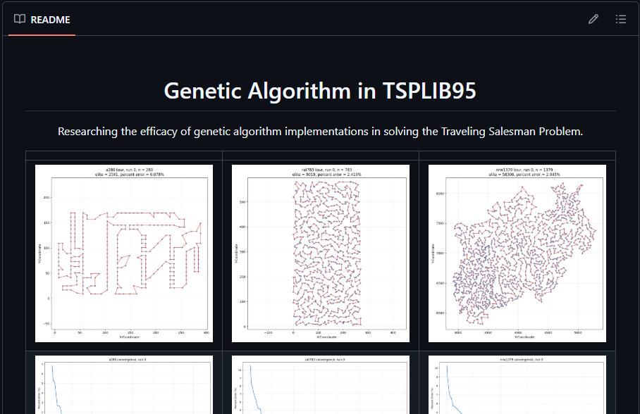
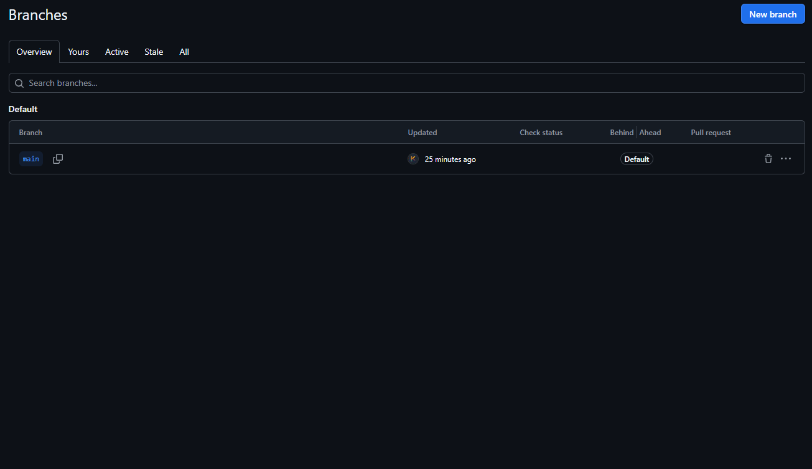
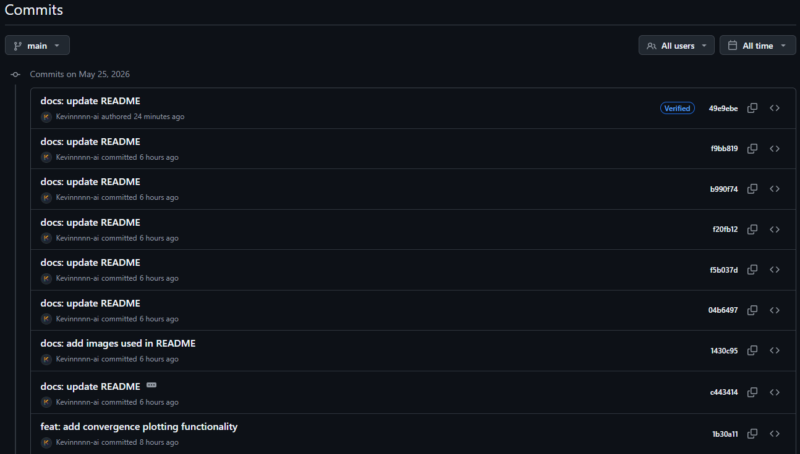
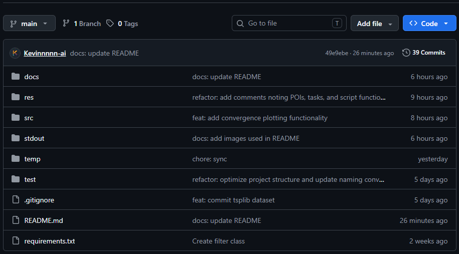
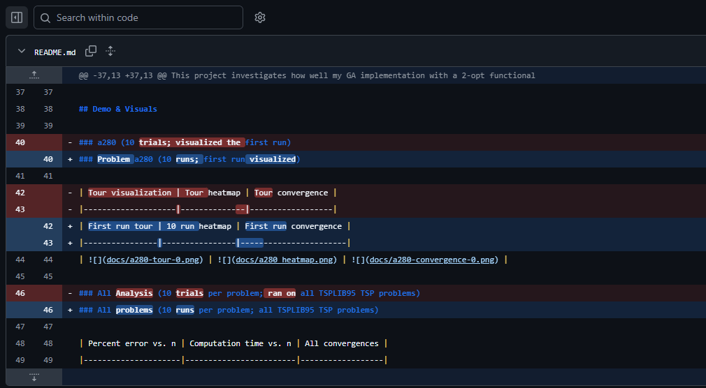
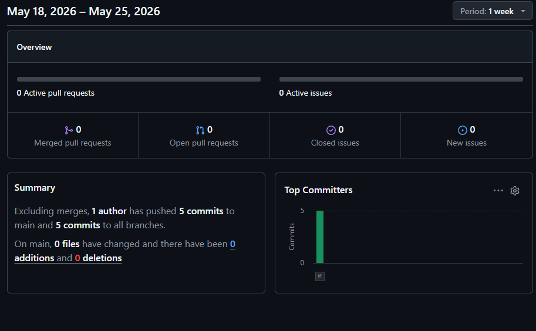

# GitHub Notes

Personal notes on GitHub best practices for those who are lost like I am.

| | | |
|-|-|-|
|  |  |  |
|  |  |  |
| | | |

 

## What?

**GitHub Notes** is a repository of markdown files where I took notes on GitHub ***best practices*** as I was learning the ropes.

 

## Why?

GitHub can be a confusing platform to understand and utilize effectively, *especially* as a new programmer. So my personal notes not only act as a way for others to ***learn from my mistakes***, but to quickly establish ***good habits*** right out of the gate.

 

## Usage & Quick Start

Simply click on each markdown file to read it.

 

  
  Powered by ideas 💡 · Last updated May 2026
  

